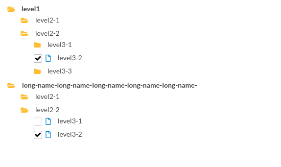

## react-treeview
>A configurable tree view component based on semantic-ui-react and powered by react.

#### Preview



#### Depends
The component depends on `semantic-ui-react` and `semantic-ui-css`, please confirm to install it and import the `semantic-ui-css` first.
```js
...
import 'semantic-ui-css/semantic.min.css';
import SourceTree from 'react-treeview-semantic';
...
```

#### How To Use
_________________

```js
// install
npm install --save react-treeview-semantic;

// import
import SourceTree from 'react-treeview-semantic';

// render
<SourceTree
  setActiveItem={this.setActiveItem}
  baseIcon={null}
  baseColor={null}
  checkable={true}
  singleChecked={true}
  treeData={treeData}
  getChecked={this.getChecked}
/>

```

#### Attributes
________________

1. treeData - [Array] - isRequired
> Data to build the tree view, see details from the `treeData details` below.

2. baseIcon - [String]
> The deafult flag of each tree-level is base, and you can customize icon of the base-item, all icons you can found in [semantic](https://react.semantic-ui.com/elements/icon).

3. baseColor - [String]
> The color for baseIcon.

4. checkable - [Bool]
> Set it to true if you wanna get a tree-level data when click the tree component.

5. singleChecked - [Bool]
> Both set `checkable` and `singleChecked` to be true,then the tree is in single selection status, only tree nodes which `flag` is not 'base' can be chosen.

6. getChecked - [Function callback]
> If tree is in single selectron or multi selection status, the `getChecked` fuction will be called with data - (`checkedItems`, `rootItem`) when select or deselect any tree nodes.

7. setActiveItem - [Function callback]
> any time, you click the tree nodes, the `setActiveItem` func will be called. In setActiveItem func, use `console.log(arguments)` to figure out all response data, normally you will receive the data of item you clicked, flag and the root item info.

#### TreeData Details
_____________________

1. flag - [base | file | table]
> The deafult value is `base`, means the current tree level is a folder and can not be selected. You can use `setActiveItem` hook func to get the flag of current tree node.

2. name
> `name` is isRequired, it doesn't matter whether repeat name already exits.

3. children
> the child nodes of curren node.

4. example
```js
// demo data
[
  {
    name: 'level1',
    flag: 'base',
    children: [
      { name: 'level2-1' },
      {
        name: 'level2-2',
        children: [
          { name: 'level3-1', children: [{ name: 'level4-1', flag: 'table'}] },
          { name: 'level3-2', flag: 'file' },
          { name: 'level3-3', children: [{ name: 'level4-2', flag: 'table' }] },
        ]
      }
    ]
  },

  {
    name: 'long-name-long-name-long-name-long-name-long-name-',
    flag: 'base',
    children: [
      { name: 'level2-1' },
      {
        name: 'level2-2',
        children: [
          { name: 'level3-1',flag: 'file' },
          { name: 'level3-2', flag: 'file' }
        ]
      }
    ]
  }
]
```

#### Demo
A full demo from my project - [react-mobx-template](https://github.com/nojsja/react-mobx-template/blob/master/app/views/page1/index.jsx)